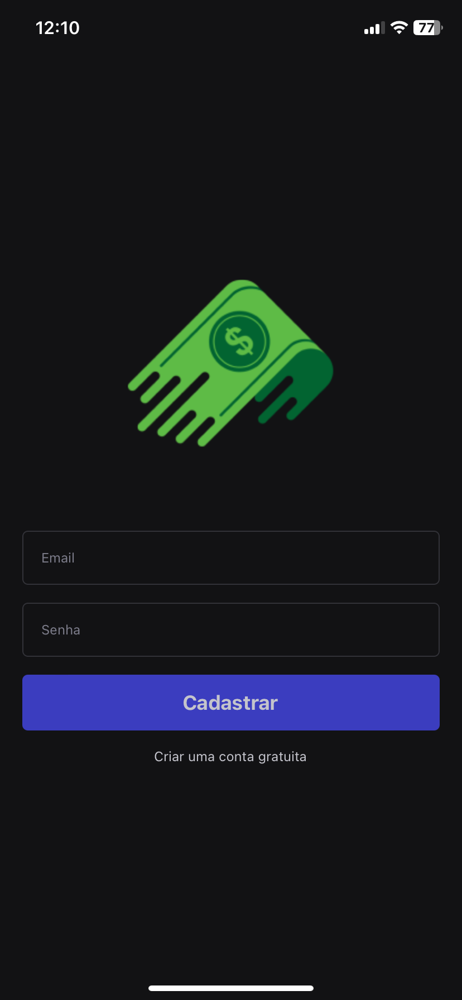
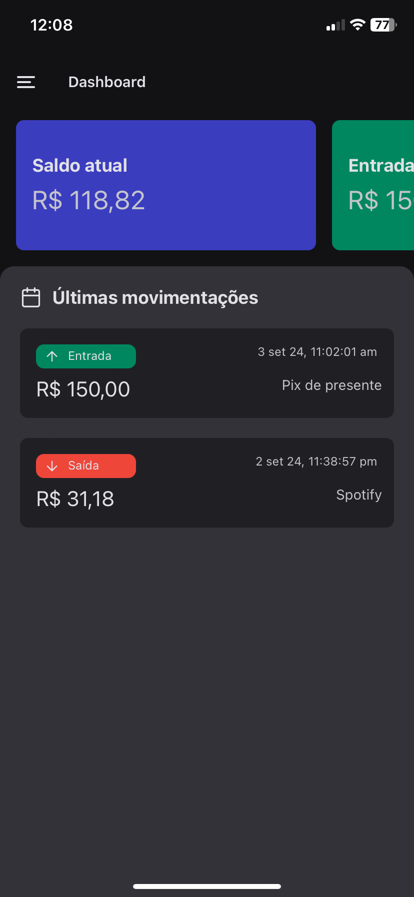
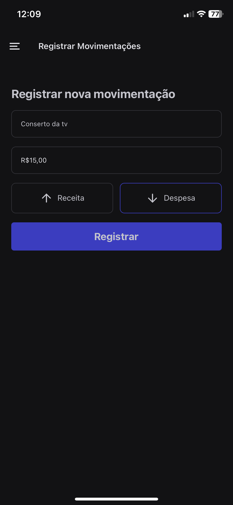
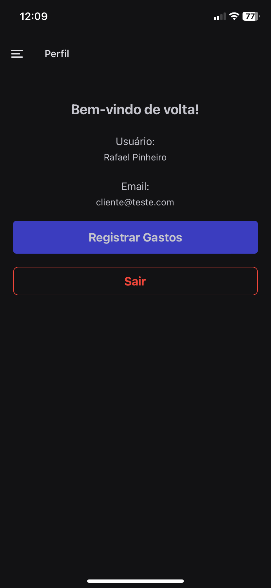

<h1 align="center">
    
    
    
    
</h1>

# Índice

- [Sobre](#-sobre)
- [Tecnologias Utilizadas](#-tecnologias-utilizadas)
- [Como Baixar o Projeto](#-como-baixar-o-projeto)

## 🔖&nbsp; Sobre

O **Meu Bolso** é um aplicativo que permite aos usuários registrar seus ganhos e gastos, ajudando a monitorar o saldo de forma mais eficiente. Ideal para quem deseja ter um controle financeiro mais rigoroso e simplificado.

---

## 🚀 Tecnologias Utilizadas

O projeto foi desenvolvido utilizando as seguintes tecnologias:

- [Expo Stack](https://createexpostack.com/)
- [Supabase](https://supabase.com/)
- [React Navigation](https://reactnavigation.org/)

---

## 🗂 Como Baixar o Projeto

```bash
# Clonar o repositório
$ git clone https://github.com/RafaMPinheiro/MeuBolso.git

# Entrar no diretório
$ cd MeuBolso

# Instalar as dependências
$ npm install

# Adicionar suas credencias supabase no arquivo
# lib/supabase.ts

# e criar as duas tables do 
#lib/types.supabase.ts

# Iniciar o projeto
$ npx expo start
```

---

Desenvolvido 💜 por Rafael Messias Pinheiro
